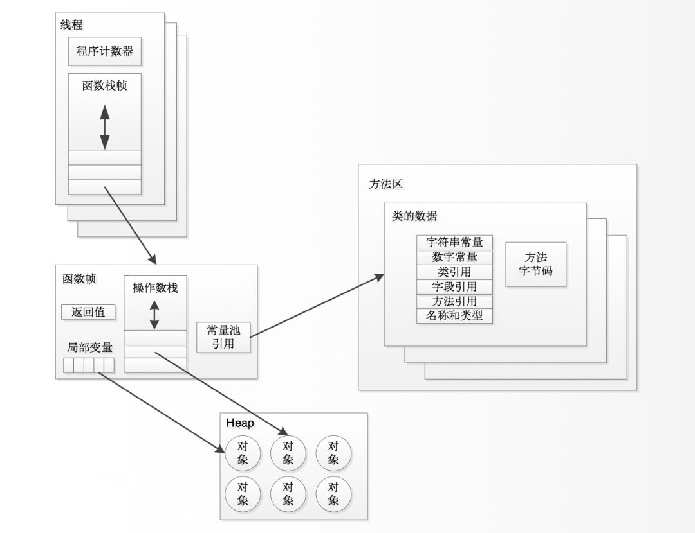

# JVM research


[Java The class File Format ](https://docs.oracle.com/javase/specs/jvms/se7/html/jvms-4.html)

中文：[JVM 揭秘：一个 class 文件的前世今生](https://zhuanlan.zhihu.com/p/33440868)

### The ClassFile Structure

```
ClassFile {
    u4             magic;
    u2             minor_version;
    u2             major_version;
    u2             constant_pool_count;
    cp_info        constant_pool[constant_pool_count-1];
    u2             access_flags;
    u2             this_class;
    u2             super_class;
    u2             interfaces_count;
    u2             interfaces[interfaces_count];
    u2             fields_count;
    field_info     fields[fields_count];
    u2             methods_count;
    method_info    methods[methods_count];
    u2             attributes_count;
    attribute_info attributes[attributes_count];
}
```

Vim show bytes:

```
:%!xxd
```

## javap

```
javap -verbose testdata.java8.HelloWorld
```

```
Warning: Binary file testdata.java8.HelloWorld contains HelloWorld
Classfile /Users/fdhuang/learn/learn-rust/jvm/testdata/java8/HelloWorld.class
  Last modified Jul 10, 2020; size 535 bytes
  MD5 checksum 68b4c9f255e18ce561bb5d980f7523c0
  Compiled from "HelloWorld.java"
public class HelloWorld
  minor version: 0
  major version: 52
  flags: ACC_PUBLIC, ACC_SUPER
Constant pool:
   #1 = Methodref          #6.#20         // java/lang/Object."<init>":()V
   #2 = Fieldref           #21.#22        // java/lang/System.out:Ljava/io/PrintStream;
   #3 = String             #23            // Hello, world!
   #4 = Methodref          #24.#25        // java/io/PrintStream.println:(Ljava/lang/String;)V
   #5 = Class              #26            // HelloWorld
   #6 = Class              #27            // java/lang/Object
   #7 = Utf8               <init>
   #8 = Utf8               ()V
   #9 = Utf8               Code
  #10 = Utf8               LineNumberTable
  #11 = Utf8               LocalVariableTable
  #12 = Utf8               this
  #13 = Utf8               LHelloWorld;
  #14 = Utf8               main
  #15 = Utf8               ([Ljava/lang/String;)V
  #16 = Utf8               args
  #17 = Utf8               [Ljava/lang/String;
  #18 = Utf8               SourceFile
  #19 = Utf8               HelloWorld.java
  #20 = NameAndType        #7:#8          // "<init>":()V
  #21 = Class              #28            // java/lang/System
  #22 = NameAndType        #29:#30        // out:Ljava/io/PrintStream;
  #23 = Utf8               Hello, world!
  #24 = Class              #31            // java/io/PrintStream
  #25 = NameAndType        #32:#33        // println:(Ljava/lang/String;)V
  #26 = Utf8               HelloWorld
  #27 = Utf8               java/lang/Object
  #28 = Utf8               java/lang/System
  #29 = Utf8               out
  #30 = Utf8               Ljava/io/PrintStream;
  #31 = Utf8               java/io/PrintStream
  #32 = Utf8               println
  #33 = Utf8               (Ljava/lang/String;)V
{
  public HelloWorld();
    descriptor: ()V
    flags: ACC_PUBLIC
    Code:
      stack=1, locals=1, args_size=1
         0: aload_0
         1: invokespecial #1                  // Method java/lang/Object."<init>":()V
         4: return
      LineNumberTable:
        line 1: 0
      LocalVariableTable:
        Start  Length  Slot  Name   Signature
            0       5     0  this   LHelloWorld;

  public static void main(java.lang.String[]);
    descriptor: ([Ljava/lang/String;)V
    flags: ACC_PUBLIC, ACC_STATIC
    Code:
      stack=2, locals=1, args_size=1
         0: getstatic     #2                  // Field java/lang/System.out:Ljava/io/PrintStream;
         3: ldc           #3                  // String Hello, world!
         5: invokevirtual #4                  // Method java/io/PrintStream.println:(Ljava/lang/String;)V
         8: return
      LineNumberTable:
        line 4: 0
        line 5: 8
      LocalVariableTable:
        Start  Length  Slot  Name   Signature
            0       9     0  args   [Ljava/lang/String;
}
SourceFile: "HelloWorld.java"
```

### Run Results

Method 1:

```
ALOAD_0
INVOKESPECIAL
NOP
ACONST_NULL
RETURN
```

Method 2:

```
GETSTATIC
NOP
ICONST_M1
LDC
ICONST_0
INVOKEVIRTUAL
NOP
ICONST_1
RETURN
```

| 常量池操作 | 含义 |
|---|---|
| GETSTATIC | 获取类的静态字段，将其值压入栈顶 |
| ICONST_M1 | int 型常量 -1 进栈|
| LDC | int、float 或 String 型常量从常量池推送至栈顶|
| ICONST_0 | int 型常量 0 进栈 |
| INVOKEVIRTUAL | 调用实例方法 - 虚方法分派 |
| ICONST_1 | int 型常量 1 进栈 |


## 编译器

 - 前端编译器： JDK 的 javac、Eclipse JDT 中的 ECJ
 - 即时编译器（JIT）： HotSpot 虚拟机中的 C1、C2 编译器，Graal 编译器
 - 运行时编译器（AOT）： JDK 的 Jaotc、GNU Compiler for the Java、Excelsior JET
 

## Docs

### JVM Runtime



Thread
  - PC (Program Counter)
  - Stack
     - Frame
     - Return Value
     - Local Vars
     - Operand Stack
     - Current Class Constant Pool Ref
     